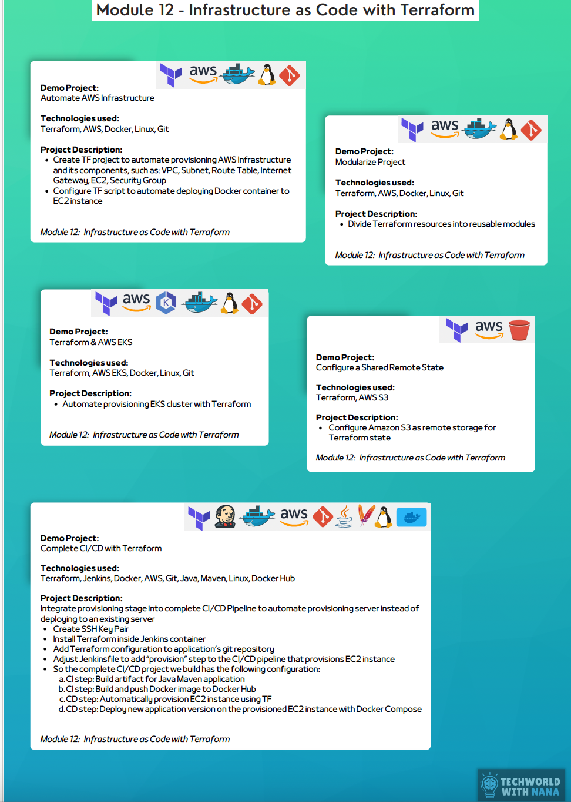

## Infrastructure as Code with Terraform
### Demo Projects and Descriptions
1. **Automate AWS Infrastructure**
    - **Technologies Used**: Terraform, AWS, Docker, Linux, Git
    - **Description**:
        - Create a Terraform (TF) project to automate the provisioning of AWS infrastructure, including VPC, Subnet, Route Table, Internet Gateway, EC2, and Security Group.
        - Configure the TF script to automate deploying a Docker container to the EC2 instance.

2. **Modularize Project**
    - **Technologies Used**: Terraform, AWS, Docker, Linux, Git
    - **Description**:
        - Divide Terraform resources into reusable modules.

3. **Terraform & AWS EKS**
    - **Technologies Used**: Terraform, AWS EKS, Docker, Linux, Git
    - **Description**:
        - Automate provisioning of an EKS cluster with Terraform.

4. **Configure a Shared Remote State**
    - **Technologies Used**: Terraform, AWS S3
    - **Description**:
        - Configure Amazon S3 as a remote storage solution for Terraform state.

5. **Complete CI/CD with Terraform**
    - **Description**:
        - Integrate a provisioning stage into a complete CI/CD pipeline to automate provisioning of servers and deploying to existing servers.
        - Steps include:
            - Create an SSH key pair.
            - Install Terraform inside Jenkins container.
            - Add Terraform configuration to the application's Git repository.
            - Adjust Jenkins to include a "provision" step in the CI/CD pipeline for provisioning an EC2 instance.
        - CI/CD Pipeline Configuration:
            - Build artifact for a Java Maven application.
            - Build and push a Docker image to Docker Hub.
            - Automatically provision EC2 instance using Terraform.
            - Deploy the new application version on the EC2 instance with Docker Compose.
## Technologies used
- Terraform
- AWS
- Docker
- Linux
- Git
- AWS EKS
- Jenkins
- Java
- Maven
- Docker Hub
- AWS S3

