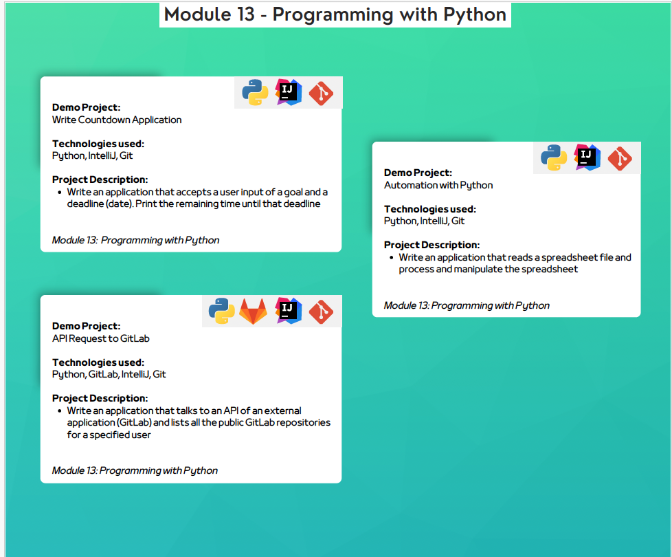

## Programming with Python
### Demo Projects and Descriptions
1. **Write Countdown Application**
    - **Technologies Used**: Python, IntelliJ, Git
    - **Description**:
        - Write an application that accepts user input of a goal and a deadline (date).
        - Print the remaining time until that deadline.

2. **Automation with Python**
    - **Technologies Used**: Python, IntelliJ, Git
    - **Description**:
        - Write an application that reads a spreadsheet file and processes and manipulates the spreadsheet.

3. **API Request to GitLab**
    - **Technologies Used**: Python, GitLab, IntelliJ, Git
    - **Description**:
        - Write an application that communicates with the API of an external application (GitLab).
        - List all the public GitLab repositories for a specified user.
## Technologies used
- Python
- Gitlab
- Git

