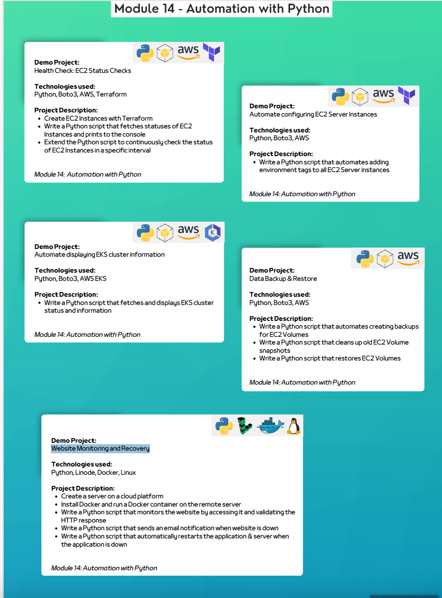

## Automation with Python
### Demo Projects and Descriptions
1. **Health Check: EC2 Status Checks**
  - **Technologies Used**: Python, Boto3, AWS, Terraform
  - **Description**:
    - Create EC2 instances with Terraform.
    - Write a Python script that fetches the statuses of EC2 instances and prints them to the console.
    - Extend the script to continuously check the status of EC2 instances at specific intervals.

2. **Automate Configuring EC2 Server Instances**
  - **Technologies Used**: Python, Boto3, AWS
  - **Description**:
    - Write a Python script that automates adding environment tags to all EC2 server instances.

3. **Automate Displaying EKS Cluster Information**
  - **Technologies Used**: Python, Boto3, AWS EKS
  - **Description**:
    - Write a Python script to fetch and display EKS cluster status and information.

4. **Data Backup & Restore**
  - **Technologies Used**: Python, Boto3, AWS
  - **Description**:
    - Write a Python script to automate creating backups for EC2 volumes.
    - Write a Python script to clean up old EC2 volume snapshots.
    - Write a Python script to restore EC2 volumes from backups.

5. **Website Monitoring and Recovery**
  - **Technologies Used**: Python, Linode, Docker, Linux
  - **Description**:
    - Create a server on a cloud platform.
    - Install Docker and run a Docker container on the remote server.
    - Write a Python script to monitor the website by accessing it and validating the HTTP response.
    - Write a Python script to send email notifications when the website is down.
    - Write a Python script to automatically restart the application and server when the application is down.
## Technologies used
- Python 
- Boto3
- EKS
- Terraform
- Linode 
- Docker
  
