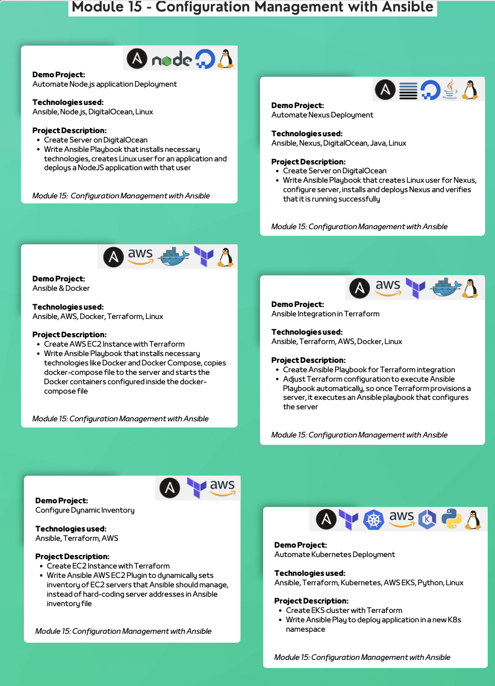

## Configuration Management with Ansible
#### Demo Projects and Descriptions
1. **Automate Node.js Application Deployment**
    - **Technologies Used**: Ansible, Node.js, DigitalOcean, Linux
    - **Description**:
        - Create a server on DigitalOcean.
        - Write an Ansible playbook that installs necessary technologies, creates a Linux user for the application, and deploys a Node.js application with that user.

2. **Automate Nexus Deployment**
    - **Technologies Used**: Ansible, Nexus, DigitalOcean, Java, Linux
    - **Description**:
        - Create a server on DigitalOcean.
        - Write an Ansible playbook to create a Linux user for Nexus, configure the server, install and deploy Nexus, and verify that it runs successfully.

3. **Ansible & Docker**
    - **Technologies Used**: Ansible, AWS, Docker, Terraform, Linux
    - **Description**:
        - Create an AWS EC2 instance with Terraform.
        - Write an Ansible playbook to install Docker and Docker Compose, copy the `docker-compose` file to the server, and start the Docker containers as defined in the file.

4. **Ansible Integration in Terraform**
    - **Technologies Used**: Ansible, Terraform, AWS, Docker, Linux
    - **Description**:
        - Create an Ansible playbook for Terraform integration.
        - Adjust Terraform to automatically execute the Ansible playbook to configure the server after it is provisioned.

5. **Configure Dynamic Inventory**
    - **Technologies Used**: Ansible, Terraform, AWS
    - **Description**:
        - Create an AWS EC2 instance with Terraform.
        - Write an Ansible AWS EC2 plugin to dynamically set the inventory of EC2 servers Ansible should manage instead of hard-coding server addresses.

6. **Automate Kubernetes Deployment**
    - **Technologies Used**: Ansible, Terraform, Kubernetes, AWS EKS, Python, Linux
    - **Description**:
        - Create an EKS cluster with Terraform.
        - Write an Ansible playbook to deploy an application in a new Kubernetes namespace.

7. **Ansible Integration in Jenkins**
    - **Technologies Used**: Ansible, Jenkins, DigitalOcean, AWS, Boto3, Docker, Java, Maven, Linux, Git
    - **Description**:
        - Create and configure dedicated servers for Jenkins and the Ansible Control Node.
        - Write an Ansible playbook to configure 2 EC2 instances.
        - Configure Jenkins to execute the Ansible playbook on the Ansible Control Node as part of the CI/CD pipeline.
        - Steps include:
            - Copy playbook and configuration files.
            - Configure SSH keys for managed nodes.
            - Install Ansible, Python3, and Boto3.
            - Execute the playbook to configure the EC2 managed nodes.

8. **Structure Playbooks with Ansible Roles**
    - **Technologies Used**: Ansible, Docker, AWS, Linux
    - **Description**:
        - Break up large Ansible playbooks into smaller, manageable files using Ansible roles.
## Technologies used
- Ansible
- AWS
- Docker
- Terraform
- Nexus
- Jenkins
- Kubernetes
- Boto3
- Node.js
- Java
- Maven
- Python

