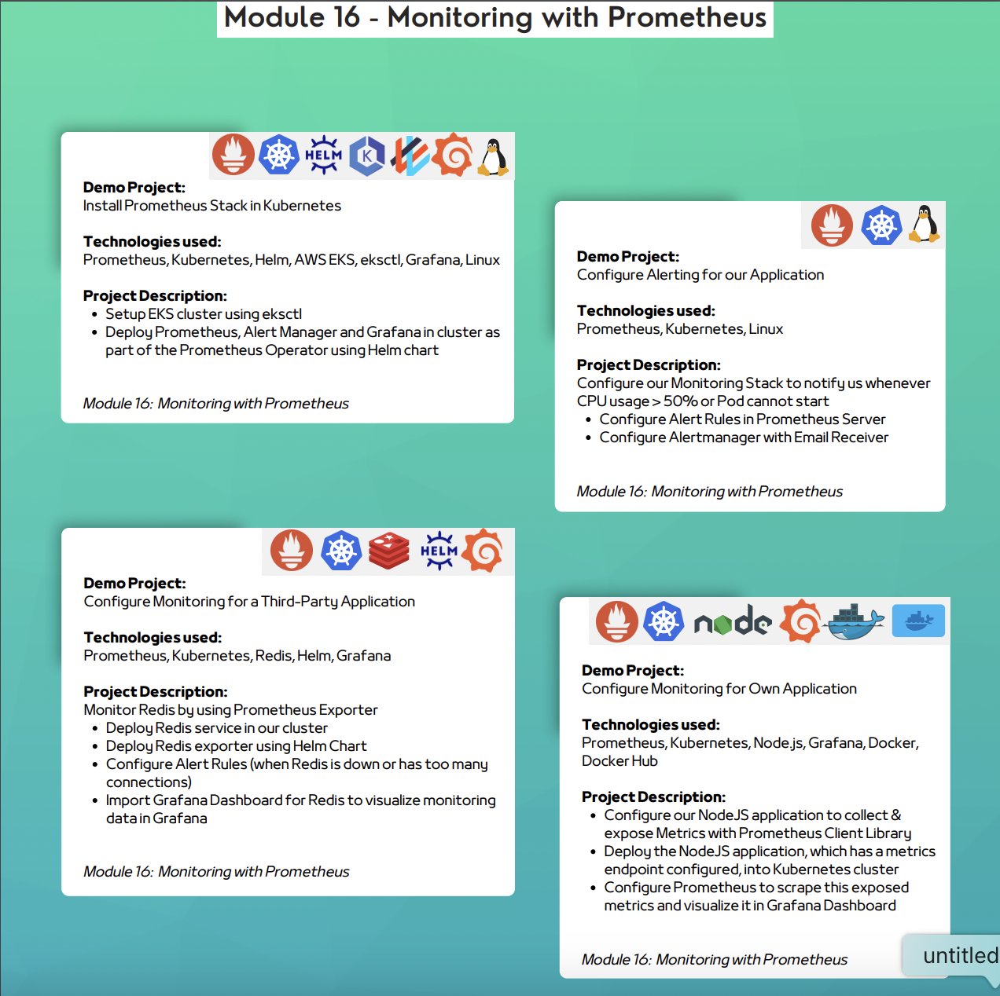

## Monitoring with Prometheus
### Demo Projects and Descriptions
1. **Install Prometheus Stack in Kubernetes**
    - **Technologies Used**: Prometheus, Kubernetes, Helm, AWS EKS, eksctl, Grafana, Linux
    - **Description**:
        - Set up an EKS cluster using `eksctl`.
        - Deploy Prometheus, Alert Manager, and Grafana in the cluster as part of the Prometheus Operator using Helm chart.

2. **Configure Alerting for Our Application**
    - **Technologies Used**: Prometheus, Kubernetes, Linux
    - **Description**:
        - Configure the monitoring stack to notify whenever:
            - CPU usage > 50%.
            - A pod cannot start.
        - Set up alert rules in Prometheus Server.
        - Configure Alertmanager with email notifications.

3. **Configure Monitoring for a Third-Party Application**
    - **Technologies Used**: Prometheus, Kubernetes, Redis, Helm, Grafana
    - **Description**:
        - Monitor Redis using Prometheus Exporter.
        - Deploy Redis service in the cluster.
        - Use Helm chart to deploy Redis Exporter.
        - Configure alert rules for Redis (e.g., when Redis is down or has too many connections).
        - Import Grafana Dashboard for Redis to visualize monitoring data.

4. **Configure Monitoring for Own Application**
    - **Technologies Used**: Prometheus, Kubernetes, Node.js, Grafana, Docker, Docker Hub
    - **Description**:
        - Configure a Node.js application to collect and expose metrics with the Prometheus Client Library.
        - Deploy the Node.js application, which has metrics configured, into the Kubernetes cluster.
        - Use Prometheus to scrape the exposed metrics and visualize them in the Grafana Dashboard.

---

### Technologies Used in Module 16
- **Prometheus**
- **Kubernetes**
- **Helm**
- **AWS EKS**
- **eksctl**
- **Grafana**
- **Linux**
- **Redis**
- **Node.js**
- **Docker**
- **Docker Hub**

