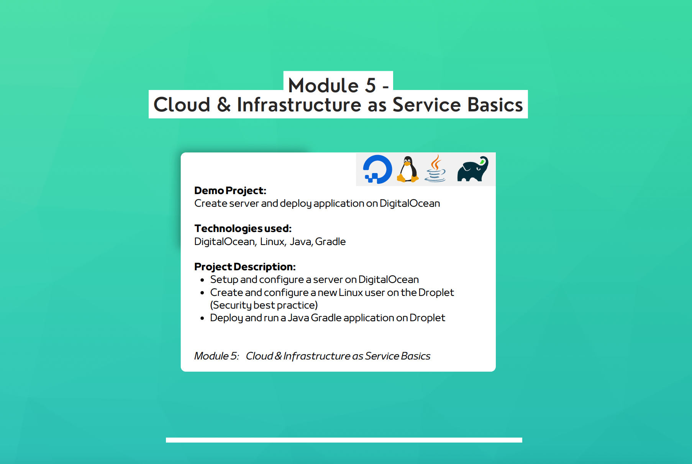

## Cloud & Infrastructure as Service Basics
### Demo Project and Description

1. **Create Server and Deploy Application on DigitalOcean**
    - **Technologies Used**: DigitalOcean, Linux, Java, Gradle
    - **Description**:
        - Set up and configure a server on DigitalOcean.
        - Create and configure a new Linux user on the droplet (security best practice).
        - Deploy and run a Java Gradle application on the droplet.

---

### Technologies Used in Module 5
- **DigitalOcean**
- **Linux**
- **Java**
- **Gradle**
