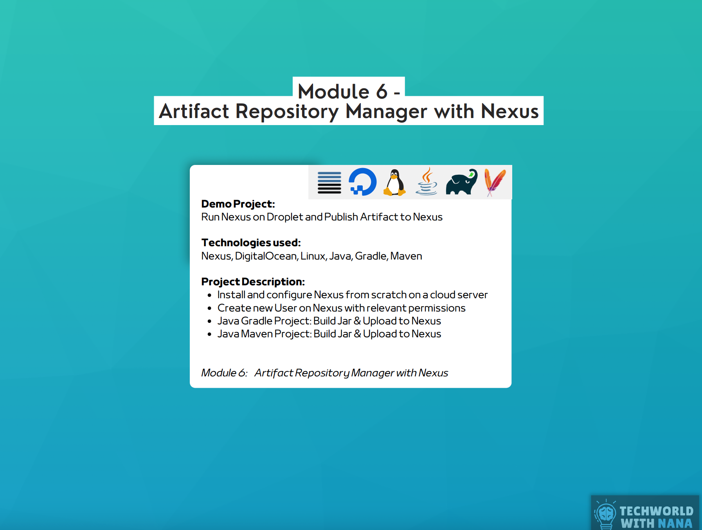

## Module 6 - Artifact Repository Manager with Nexus
### Demo Project and Description

1. **Run Nexus on Droplet and Publish Artifact to Nexus**
    - **Technologies Used**: Nexus, DigitalOcean, Linux, Java, Gradle, Maven
    - **Description**:
        - Install and configure Nexus from scratch on a cloud server.
        - Create a new user on Nexus with relevant permissions.
        - Use a Java Gradle project to build a JAR file and upload it to Nexus.
        - Use a Java Maven project to build a JAR file and upload it to Nexus.

---

### Technologies Used in Module 6
- **Nexus**
- **DigitalOcean**
- **Linux**
- **Java**
- **Gradle**
- **Maven**
