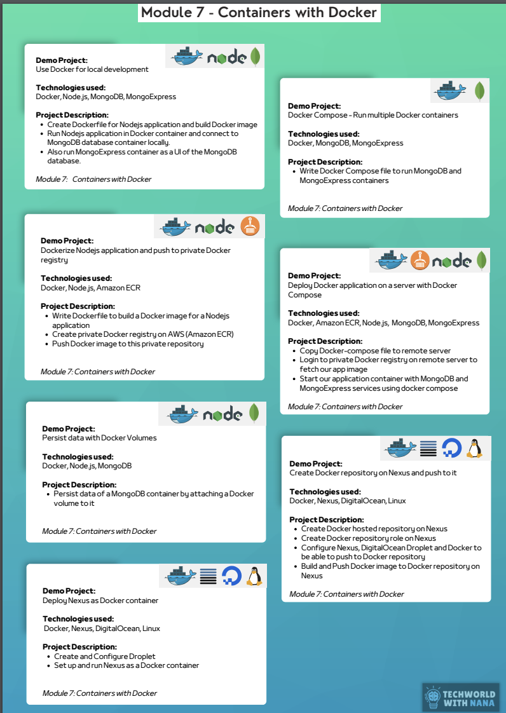

## Containers with Docker
### Demo Projects and Descriptions
1. **Use Docker for Local Development**
    - **Technologies Used**: Docker, Node.js, MongoDB, Mongo Express
    - **Description**:
        - Create containers for Node.js applications and build Docker images.
        - Run Node.js applications in a containerized environment.
        - Allow seamless connection to MongoDB for CRUD operations.
        - Use Mongo Express to manage MongoDB database visually.

2. **Docker Compose - Run Multiple Docker Containers**
    - **Technologies Used**: Docker, Node.js, MongoDB, Mongo Express
    - **Description**:
        - Write Docker Compose files to run Node.js and MongoDB containers.
        - Simplify the setup and management of multiple containers.

3. **Docker Build and Push to Private Docker Registry**
    - **Technologies Used**: Docker, Node.js, Amazon ECR
    - **Description**:
        - Use Dockerfile to build a Docker image for a Node.js application.
        - Push the image to a private registry (AWS ECR).
        - Pull and run the Docker image from AWS ECR.

4. **Deploy Docker Application on Server with Docker Compose**
    - **Technologies Used**: Docker, Amazon ECR, Node.js, MongoDB, Mongo Express
    - **Description**:
        - Set up a remote server with Docker.
        - Pull Docker images from AWS ECR to the server.
        - Run multiple containers with Docker Compose to host Node.js and MongoDB applications.

5. **Persist Data with Docker Volumes**
    - **Technologies Used**: Docker, Node.js
    - **Description**:
        - Configure Docker volumes to ensure data persistence between container restarts.

6. **Deploy Node.js Application with Docker**
    - **Technologies Used**: Docker, Node.js
    - **Description**:
        - Dockerize a Node.js application using Dockerfiles.
        - Run the application in a containerized environment.

7. **Containerize a Web Application and Push to DockerHub**
    - **Technologies Used**: Docker, Jenkins, DigitalOcean, Linux
    - **Description**:
        - Build Docker images for web applications.
        - Push the images to DockerHub.
        - Deploy the containerized application to a DigitalOcean server.

---

### Technologies Used in Module 7
- **Docker**
- **Node.js**
- **MongoDB**
- **Mongo Express**
- **Amazon ECR**
- **Docker Compose**
- **Jenkins**
- **DigitalOcean**
- **Linux**
