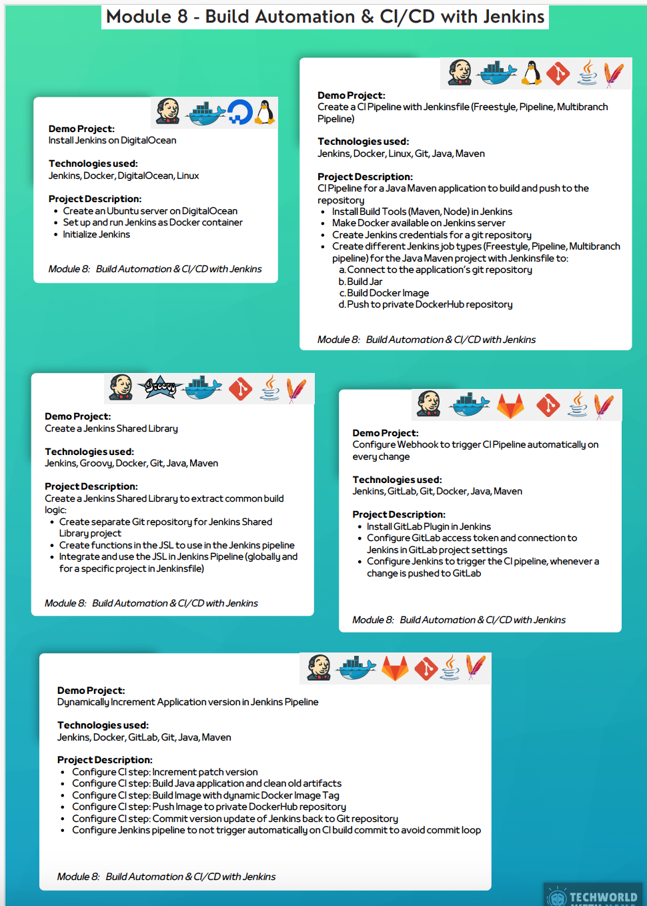

## Build Automation & CI/CD with Jenkins
### Demo Projects and Descriptions
1. **Install Jenkins on DigitalOcean**
    - **Technologies Used**: Jenkins, Docker, DigitalOcean, Linux
    - **Description**:
        - Provision a server on DigitalOcean.
        - Install Jenkins on the server to set up CI/CD pipelines.

2. **Create a CI Pipeline with Jenkinsfile (Freestyle, Pipeline, Multibranch Pipeline)**
    - **Technologies Used**: Jenkins, Docker, Linux, Git, Java, Maven
    - **Description**:
        - Build and deploy a web application using Jenkins:
            - Freestyle Pipeline: Build and push the application.
            - Pipeline: Configure using a Jenkinsfile.
            - Multibranch Pipeline: Automatically detect changes from branches in a Git repository.
        - Use GitHub to trigger CI/CD processes.

3. **Create Jenkins Shared Library**
    - **Technologies Used**: Jenkins, Docker, Git, Java, Maven
    - **Description**:
        - Create a shared Git repository for Jenkins Shared Library.
        - Write Jenkinsfile with reusable functions from the shared library.
        - Automate pipeline steps using reusable code for better efficiency.

4. **Configure GitHub Webhook to Trigger CI Pipeline Automatically on Code Changes**
    - **Technologies Used**: Jenkins, Git, Java, Maven
    - **Description**:
        - Configure GitHub webhook to trigger Jenkins pipelines automatically on code updates.
        - Automate the CI process for every code change in the Git repository.

5. **Dynamic Project Requirements Automation in Jenkins Pipeline**
    - **Technologies Used**: Jenkins, Docker, GitLab, Git, Java, Maven
    - **Description**:
        - Write a Jenkins pipeline to support dynamic project data.
        - Configure dynamic parameterized builds.
        - Pull project details dynamically from GitLab.
        - Build and deploy projects with changing requirements using Jenkins.

---

### Technologies Used in Module 8
- **Jenkins**
- **Docker**
- **DigitalOcean**
- **Linux**
- **Git**
- **GitHub**
- **GitLab**
- **Java**
- **Maven**
