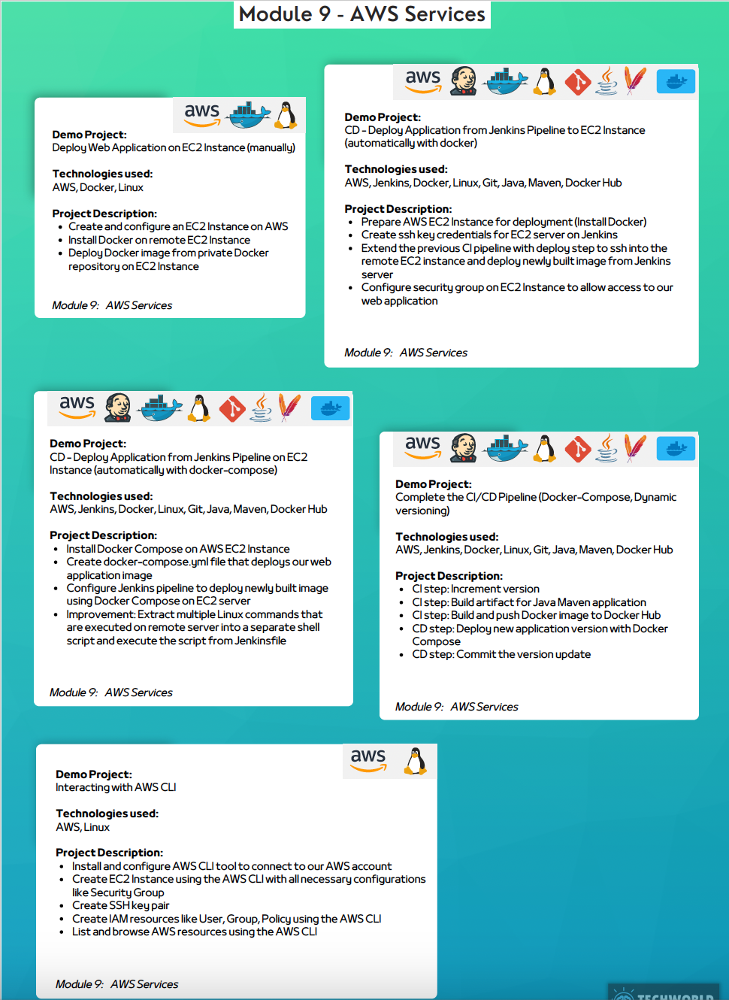

## AWS Services
### Demo Projects and Descriptions
1. **Deploy Web Application on EC2 Instance Manually**
    - **Technologies Used**: AWS, Docker, Linux
    - **Description**:
        - Create an EC2 instance on AWS.
        - Install Docker and Docker Compose.
        - Deploy Docker containers with the application using Docker Compose.

2. **CD - Deploy Application from Jenkins Pipeline to EC2 Instance (Automated with Docker)**
    - **Technologies Used**: AWS, Jenkins, Docker, Linux, Git, Java, Maven, Docker Hub
    - **Description**:
        - Create an EC2 instance on AWS.
        - Write a Jenkins pipeline to automate the deployment of a web application.
        - Automate the deployment of Dockerized applications using Jenkins.

3. **CD - Deploy Application from Jenkins Pipeline to EC2 Instance (Automated with Docker Compose)**
    - **Technologies Used**: AWS, Jenkins, Docker, Linux, Git, Java, Maven, Docker Hub
    - **Description**:
        - Create an EC2 instance on AWS.
        - Write a Jenkins pipeline to automate deployment with Docker Compose.
        - Automate the deployment of multi-container applications using Jenkins.

4. **Complete CI/CD Pipeline (Docker-Compose, Dynamic Inventory)**
    - **Technologies Used**: Jenkins, Docker, Linux, Git, Java, Maven, Docker Hub
    - **Description**:
        - Set up Jenkins pipeline for CI/CD.
        - Configure dynamic inventory with Ansible for flexible deployments.
        - Deploy containerized applications with Docker Compose.
        - Commit and manage version updates.

5. **Interact with AWS CLI**
    - **Technologies Used**: AWS CLI, Linux
    - **Description**:
        - Install and configure AWS CLI to connect to an AWS account.
        - Execute commands to create AWS resources and automate configurations.
        - List and manage AWS resources using AWS CLI.

---

### Technologies Used in Module 9
- **AWS**
- **Docker**
- **Linux**
- **Jenkins**
- **Git**
- **Java**
- **Maven**
- **Docker Compose**
- **Docker Hub**
- **AWS CLI**

